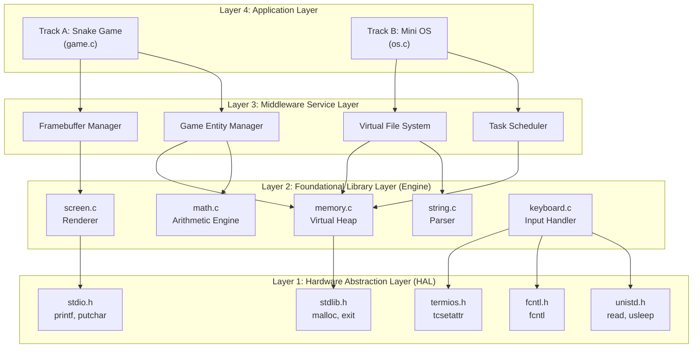
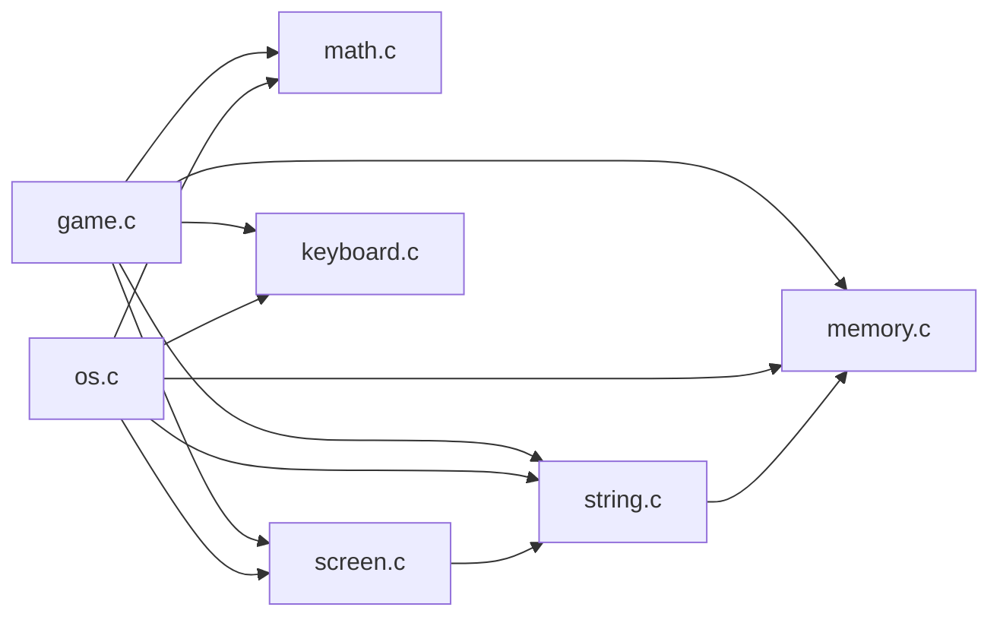
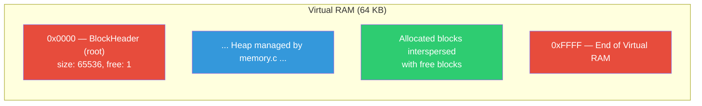
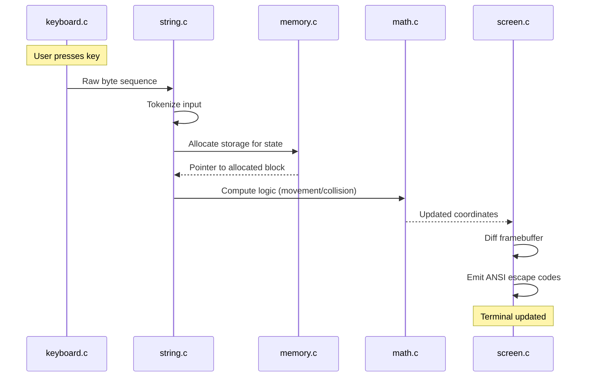
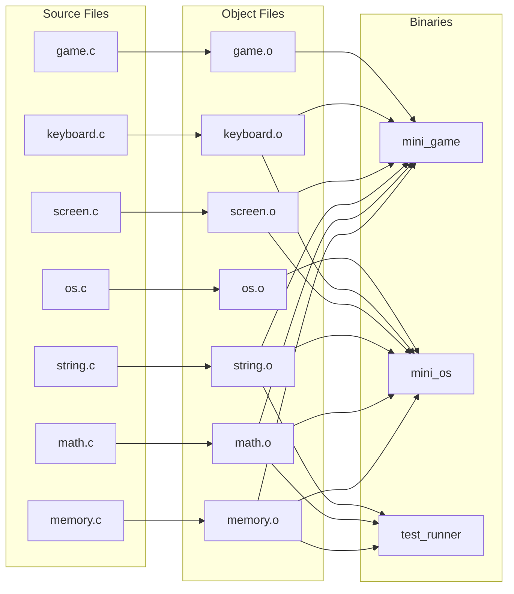
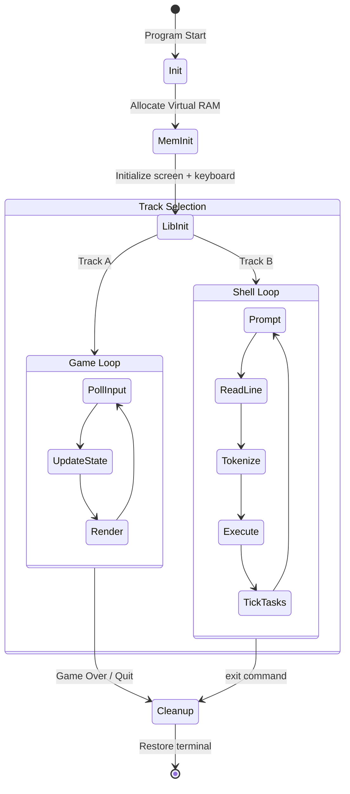

# System Architecture

## 1. Overview

The Mini OS project follows a **layered architecture** where each layer depends only on the layers below it. This ensures clean separation of concerns and allows the foundational libraries to be tested independently of the application logic.

---

## 2. The Four-Layer Model

---

## 3. Module Dependency Graph

---

## 4. Memory Map — Virtual RAM Layout

The entire system operates within a single contiguous block of memory allocated once at startup. The custom allocator then manages this block.

### Memory Regions

| Region | Size | Purpose | Management |
|--------|------|---------|------------|
| Static Data | Compile-time | Global variables, constants | Fixed allocation |
| The Heap | ~64 KB | Dynamic objects, file blocks, buffers | `memory.c` First-Fit Free List |
| VFS Table | Variable | Inode metadata, directory structures | Heap allocations |
| Input Buffer | 256 bytes | Raw terminal input bytes | Linear buffer in `keyboard.c` |
| Framebuffer | W×H×2 | Front + back screen buffers | Static arrays in `screen.c` |

---

## 5. Data Flow Pipeline

---

## 6. Build Architecture

---

## 7. Error Handling Strategy

The system uses a layered error reporting approach:

| Layer | Strategy | Example |
|-------|----------|---------|
| memory.c | Return `NULL` on failure | `mem_alloc(too_large)` → `NULL` |
| string.c | Truncate with null terminator | `str_copy(dst, src, 5)` → safe truncation |
| math.c | Clamp values, avoid UB | `m_div(x, 0)` → return 0 with error flag |
| screen.c | Silently ignore out-of-bounds | `scr_put_char(-1, -1, ...)` → no-op |
| keyboard.c | Return sentinel values | `kb_key_pressed()` → 0 if no key |

---

## 8. Thread of Control

