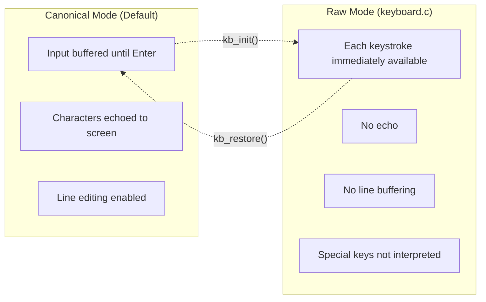
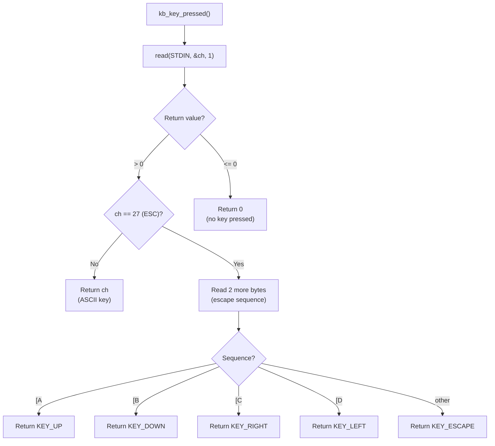
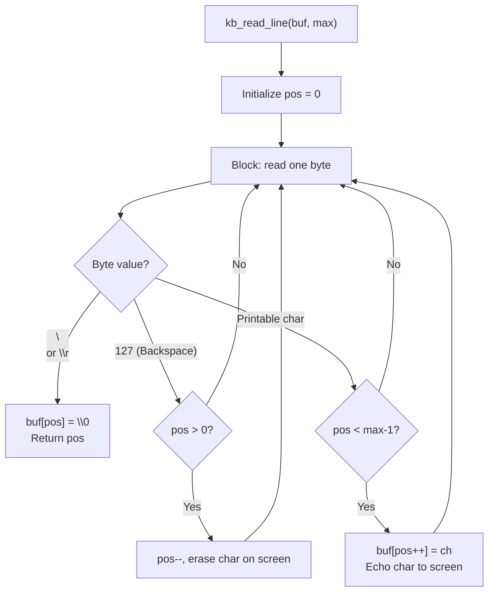
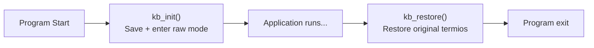

# keyboard.c — Input Handler Design

## 1. Overview

The keyboard library provides non-blocking input capture by switching the terminal from its default **canonical mode** to **raw mode**. This enables real-time keystroke detection for both the game loop (Track A) and the interactive shell (Track B).

---

## 2. Terminal Modes



---

## 3. Raw Mode Configuration

### 3.1 termios Setup

```c
struct termios raw;
tcgetattr(STDIN_FILENO, &raw);

// Save original settings for restoration
original_termios = raw;

// Modify flags
raw.c_lflag &= ~(ECHO | ICANON);     // No echo, no line buffering
raw.c_cc[VMIN] = 0;                    // Non-blocking: return immediately
raw.c_cc[VTIME] = 0;                   // No timeout

tcsetattr(STDIN_FILENO, TCSAFLUSH, &raw);
```

### 3.2 Non-Blocking I/O via fcntl

```c
int flags = fcntl(STDIN_FILENO, F_GETFL, 0);
fcntl(STDIN_FILENO, F_SETFL, flags | O_NONBLOCK);
```

---

## 4. Key Detection Flow



### Arrow Key Escape Sequences

Arrow keys send 3-byte sequences:

| Key | Byte 1 | Byte 2 | Byte 3 | Constant |
|-----|--------|--------|--------|----------|
| Up | `27` (ESC) | `91` ([) | `65` (A) | `KEY_UP = 1000` |
| Down | `27` (ESC) | `91` ([) | `66` (B) | `KEY_DOWN = 1001` |
| Right | `27` (ESC) | `91` ([) | `67` (C) | `KEY_RIGHT = 1002` |
| Left | `27` (ESC) | `91` ([) | `68` (D) | `KEY_LEFT = 1003` |

---

## 5. Line Reading (Shell Mode)



---

## 6. Terminal Restoration

**Critical**: The terminal MUST be restored to its original state when the program exits, otherwise the user's shell will remain in raw mode.



The restoration function is registered with `atexit()` to ensure it runs even on unexpected termination.

---

## 7. API Reference

| Function | Signature | Description |
|----------|-----------|-------------|
| `kb_init` | `void kb_init(void)` | Enter raw mode, save original settings |
| `kb_restore` | `void kb_restore(void)` | Restore canonical mode |
| `kb_key_pressed` | `int kb_key_pressed(void)` | Non-blocking key read (0 = none) |
| `kb_read_line` | `int kb_read_line(char* buf, int max)` | Blocking line read with echo |

### Key Constants

| Constant | Value | Description |
|----------|-------|-------------|
| `KEY_UP` | 1000 | Up arrow |
| `KEY_DOWN` | 1001 | Down arrow |
| `KEY_LEFT` | 1002 | Left arrow |
| `KEY_RIGHT` | 1003 | Right arrow |
| `KEY_ESCAPE` | 27 | Escape key |
| `KEY_ENTER` | 10 | Enter/Return |
| `KEY_BACKSPACE` | 127 | Backspace/Delete |
