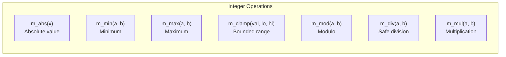
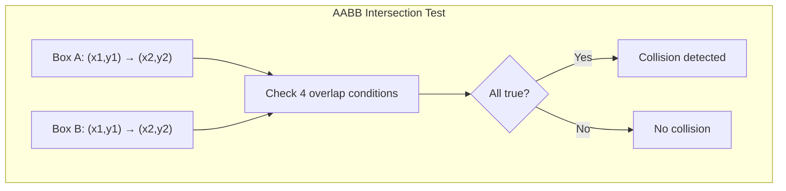

# math.c — Arithmetic Engine Design

## 1. Overview

The math library provides integer-based arithmetic operations and spatial boundary helpers, all implemented without `<math.h>`. It serves as the logical computation engine for both game physics (Track A) and file system calculations (Track B).

---

## 2. Core Functions

### 2.1 Integer Arithmetic



| Function | Algorithm | Edge Cases |
|----------|-----------|------------|
| `m_abs(x)` | `(x < 0) ? -x : x` | `INT_MIN` handled via unsigned cast |
| `m_min(a,b)` | Ternary comparison | — |
| `m_max(a,b)` | Ternary comparison | — |
| `m_clamp(v,lo,hi)` | `m_max(lo, m_min(v, hi))` | `lo > hi` returns `lo` |
| `m_mod(a,b)` | `a - (a/b)*b` | `b == 0` returns 0 |
| `m_div(a,b)` | Native `/` operator | `b == 0` returns 0 |
| `m_mul(a,b)` | Native `*` operator | — |

---

## 3. Spatial Boundary Helpers

### 3.1 AABB Intersection

Two axis-aligned bounding boxes intersect when all four overlap conditions are true:

$$\text{intersects} = (A.x_1 < B.x_2) \land (A.x_2 > B.x_1) \land (A.y_1 < B.y_2) \land (A.y_2 > B.y_1)$$



### 3.2 Point-in-Rectangle

Tests whether a point (px, py) lies within a rectangle defined by (rx, ry, rw, rh):

```
point_in_rect = (px >= rx) && (px < rx + rw) && (py >= ry) && (py < ry + rh)
```

### 3.3 Distance (Manhattan)

For grid-based games, Manhattan distance avoids square roots:

$$d = |x_1 - x_2| + |y_1 - y_2|$$

---

## 4. Random Number Generator

A simple **Linear Congruential Generator (LCG)** for pseudo-random numbers (used for food placement in Snake):

$$X_{n+1} = (a \cdot X_n + c) \mod m$$

With constants: `a = 1103515245`, `c = 12345`, `m = 2^31`

```c
static unsigned int rng_state = 1;

void m_srand(unsigned int seed) { rng_state = seed; }

int m_rand(void) {
    rng_state = rng_state * 1103515245 + 12345;
    return (rng_state >> 16) & 0x7FFF;
}

int m_rand_range(int min, int max) {
    return min + m_mod(m_rand(), (max - min + 1));
}
```

---

## 5. API Reference

| Function | Signature | Description |
|----------|-----------|-------------|
| `m_abs` | `int m_abs(int x)` | Absolute value |
| `m_min` | `int m_min(int a, int b)` | Minimum of two integers |
| `m_max` | `int m_max(int a, int b)` | Maximum of two integers |
| `m_clamp` | `int m_clamp(int val, int lo, int hi)` | Clamp value to range |
| `m_mod` | `int m_mod(int a, int b)` | Safe modulo |
| `m_div` | `int m_div(int a, int b)` | Safe integer division |
| `m_mul` | `int m_mul(int a, int b)` | Multiplication |
| `m_aabb_intersect` | `int m_aabb_intersect(...)` | AABB collision test |
| `m_point_in_rect` | `int m_point_in_rect(...)` | Point inside rectangle |
| `m_distance` | `int m_distance(int x1, int y1, int x2, int y2)` | Manhattan distance |
| `m_rand` | `int m_rand(void)` | Pseudo-random number |
| `m_rand_range` | `int m_rand_range(int min, int max)` | Random in range |
| `m_srand` | `void m_srand(unsigned int seed)` | Seed the RNG |
