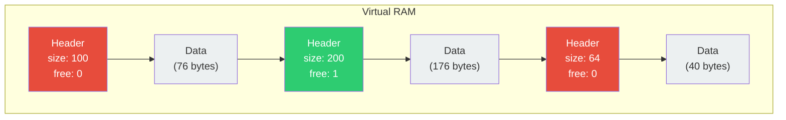
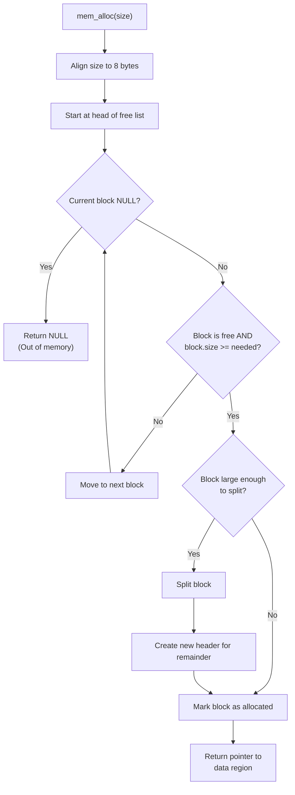
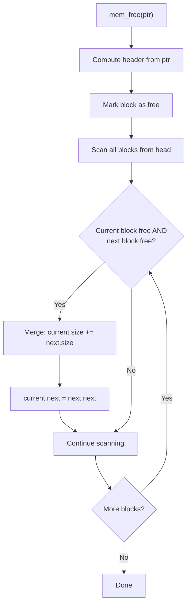

# memory.c — Virtual Heap Allocator Design

## 1. Overview

The memory allocator is the most critical component of the freestanding system. It manages a single contiguous block of memory ("Virtual RAM") using a **First-Fit Free List** algorithm with **block splitting** and **forward coalescing**.

---

## 2. Data Structures

### 2.1 BlockHeader

Every block in the heap is preceded by a metadata header:

```c
typedef struct BlockHeader {
    size_t size;              // Total block size INCLUDING header
    int    is_free;           // 1 = free, 0 = allocated
    struct BlockHeader *next; // Next block in the linked list
} BlockHeader;
```

### 2.2 Memory Layout



---

## 3. Alignment Strategy

All allocations are 8-byte aligned for optimal performance on 64-bit architectures:

$$\text{aligned\_size} = (\text{requested\_size} + 7) \mathbin{\&} \sim 7$$

The `BlockHeader` struct itself is padded to ensure the data region starts at an aligned boundary:

```
| Header (24 bytes) | Data (aligned to 8) | Header | Data | ...
```

---

## 4. Allocation Algorithm — First-Fit



### Split Condition

A block is split only if the remaining space after allocation can hold at least one header plus 8 bytes of data:

```
remaining = block.size - needed_size
if (remaining >= sizeof(BlockHeader) + 8) → SPLIT
```

---

## 5. Deallocation & Coalescing



### Coalescing Example

```
Before free(B):
  [A: used, 64] → [B: used, 128] → [C: free, 256] → [D: used, 64]

After free(B):
  [A: used, 64] → [B: free, 128] → [C: free, 256] → [D: used, 64]

After coalescing:
  [A: used, 64] → [BC: free, 384] → [D: used, 64]
```

---

## 6. API Reference

| Function | Signature | Description |
|----------|-----------|-------------|
| `mem_init` | `void mem_init(void* raw, size_t size)` | Initialize heap with given memory block |
| `mem_alloc` | `void* mem_alloc(size_t size)` | Allocate `size` bytes (8-byte aligned) |
| `mem_free` | `void mem_free(void* ptr)` | Free previously allocated block |
| `mem_available` | `size_t mem_available(void)` | Return total free bytes |
| `mem_dump` | `void mem_dump(void)` | Print heap state for debugging |

---

## 7. Safety Considerations

1. **NULL check on alloc failure**: All callers must check for NULL returns
2. **Double-free protection**: `mem_free` checks if block is already free
3. **Invalid pointer detection**: Verify pointer falls within Virtual RAM bounds
4. **Alignment enforcement**: All returned pointers guaranteed 8-byte aligned
