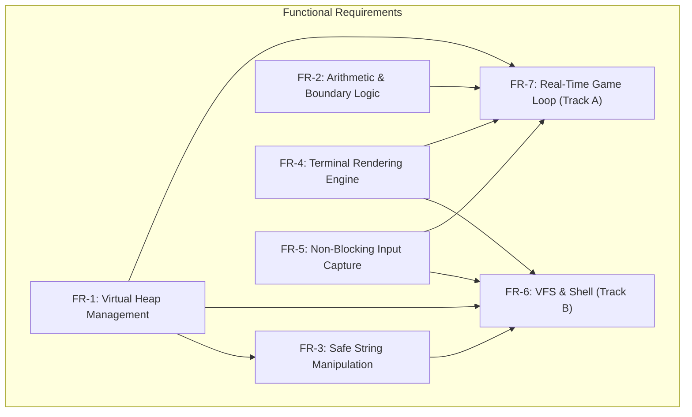
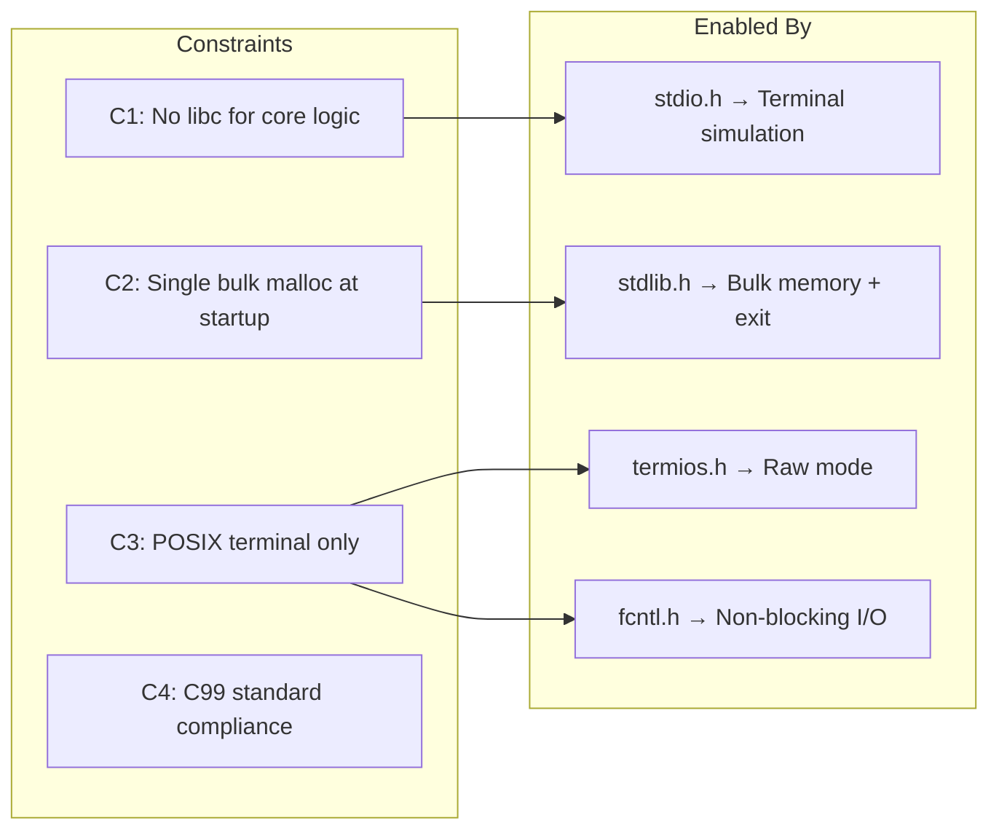
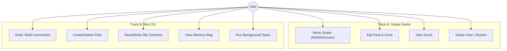

# Systems Requirement Specification (SRS)

## 1. Introduction

This document defines the complete functional and non-functional requirements for the **Mini OS** project — a freestanding systems programming capstone that builds five core C libraries from scratch and integrates them into two application tracks: an interactive Snake game (Track A) and a Mini Operating System with VFS and shell (Track B).

### 1.1 Purpose

To establish clear, measurable requirements that guide the implementation of a freestanding C runtime, ensuring all modules interact correctly without reliance on the C Standard Library for core logic.

### 1.2 Scope

The system encompasses:
- Five foundational libraries: `memory.c`, `math.c`, `string.c`, `screen.c`, `keyboard.c`
- Track A: Real-time Snake game
- Track B: Mini OS with Virtual File System, command shell, and cooperative task scheduler

### 1.3 Permitted Dependencies

| Header | Purpose | Usage Scope |
|--------|---------|-------------|
| `<stdio.h>` | `printf`, `putchar`, `fflush` | Terminal I/O simulation only |
| `<stdlib.h>` | `malloc` (one-time), `exit` | Initial bulk memory acquisition, process exit |
| `<termios.h>` | `tcgetattr`, `tcsetattr` | Raw mode terminal configuration |
| `<fcntl.h>` | `fcntl` | Non-blocking stdin configuration |
| `<unistd.h>` | `read`, `usleep` | Low-level byte read, frame timing |

---

## 2. Functional Requirements

### 2.1 Overview Diagram

### 2.2 Detailed Requirements

| ID | Requirement | Description | Priority |
|----|------------|-------------|----------|
| FR-1 | Virtual Heap Management | Initialize a contiguous memory region and provide `mem_alloc()` and `mem_free()` with First-Fit search, block splitting, and forward coalescing. | **Critical** |
| FR-2 | Arithmetic & Boundary Logic | Implement `m_abs`, `m_mod`, `m_div`, `m_clamp`, `m_min`, `m_max`, and AABB intersection detection without `<math.h>`. | **High** |
| FR-3 | Safe String Manipulation | Provide `str_length`, `str_copy`, `str_compare`, `str_concat`, `str_itoa`, `str_atoi`, and `str_split` with bounds-safe semantics. | **Critical** |
| FR-4 | Terminal Rendering Engine | Interface with terminal via ANSI escape codes. Support cursor positioning, colored character output, box drawing, and diff-based framebuffer refresh. | **Critical** |
| FR-5 | Non-Blocking Input Capture | Switch terminal to raw mode. Implement `kb_key_pressed()` for non-blocking reads and `kb_read_line()` for interactive line input with echo. | **Critical** |
| FR-6 | VFS & Shell | Implement Virtual File System with inodes, superblock, and directory support. Shell must parse and execute: `help`, `ls`, `touch`, `write`, `read`, `rm`, `cat`, `echo`, `memmap`, `clear`. | **High** |
| FR-7 | Real-Time Game Loop | Snake game with dynamic entity allocation, collision detection, score tracking, difficulty scaling, and smooth rendering at consistent frame rate. | **High** |

---

## 3. Non-Functional Requirements

| ID | Requirement | Description | Metric |
|----|------------|-------------|--------|
| NFR-1 | Freestanding Execution | No standard library calls for core logic | Zero `#include` of `<string.h>`, `<math.h>`, standard `malloc`/`free` in core libs |
| NFR-2 | Memory Safety | Deterministic allocation with coalescing | No memory leaks after 1000+ alloc/free cycles |
| NFR-3 | Real-Time Performance | Consistent frame rate for Track A | Input-to-render latency < 50ms |
| NFR-4 | Zero Hard-Coded Logic | All logic computed dynamically | No magic numbers for boundaries or parsing |
| NFR-5 | Alignment | Heap allocations are 8-byte aligned | `(ptr & 7) == 0` for all returned pointers |
| NFR-6 | Portability | Compiles with `-Wall -Wextra -std=c99` | Zero warnings on macOS clang |

---

## 4. Constraint Matrix

---

## 5. Use Case Diagram

---

## 6. Acceptance Criteria

1. **All five libraries compile** with `clang -Wall -Wextra -Werror -std=c99 -pedantic`
2. **Memory tests pass**: 1000+ alloc/free cycles with zero leaks and correct coalescing
3. **Snake game is playable**: responsive controls, correct collision, visible score
4. **Mini OS shell is functional**: all 10 commands execute correctly
5. **Background tasks run**: clock/counter updates while shell is interactive
6. **No standard library usage**: verified by `nm` output showing no libc symbol references in core logic
