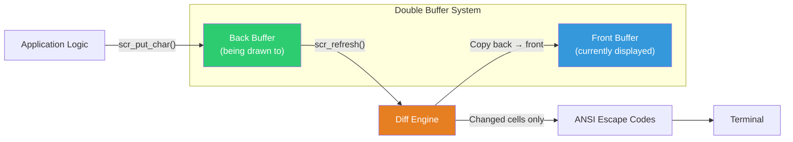
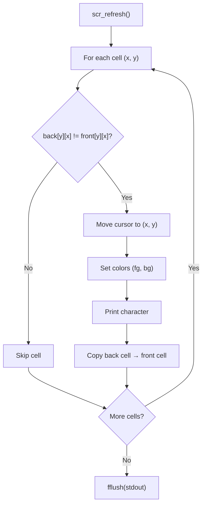
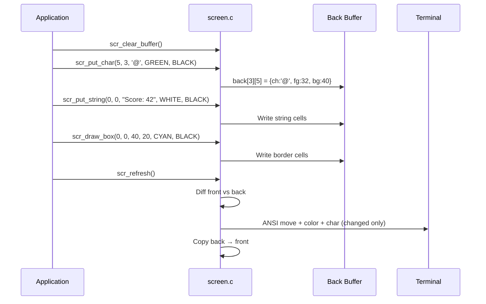

# screen.c — Terminal Renderer Design

## 1. Overview

The screen library transforms the terminal into a 2D rendering surface using **ANSI escape codes**. It implements a **double-buffered framebuffer** to minimize flickering and optimize I/O by only transmitting changed characters.

---

## 2. ANSI Escape Code Reference

| Sequence | Effect | Example |
|----------|--------|---------|
| `\033[2J` | Clear entire screen | — |
| `\033[H` | Move cursor to home (0,0) | — |
| `\033[{row};{col}H` | Move cursor to position | `\033[5;10H` |
| `\033[{n}m` | Set graphics mode | `\033[31m` (red text) |
| `\033[{fg};{bg}m` | Set foreground + background | `\033[31;42m` |
| `\033[0m` | Reset all attributes | — |
| `\033[?25l` | Hide cursor | — |
| `\033[?25h` | Show cursor | — |

### Color Codes

| Code | Foreground | Background |
|------|-----------|------------|
| 30/40 | Black | Black |
| 31/41 | Red | Red |
| 32/42 | Green | Green |
| 33/43 | Yellow | Yellow |
| 34/44 | Blue | Blue |
| 35/45 | Magenta | Magenta |
| 36/46 | Cyan | Cyan |
| 37/47 | White | White |

---

## 3. Framebuffer Architecture



### Cell Structure

Each cell in the framebuffer stores:

```c
typedef struct {
    char ch;    // Character to display
    int  fg;    // Foreground color code
    int  bg;    // Background color code
} ScreenCell;
```

### Refresh Algorithm



---

## 4. Box Drawing

The `scr_draw_box` function renders bordered rectangles using Unicode box-drawing characters:

```
┌────────────┐
│            │
│   Content  │
│            │
└────────────┘
```

Characters used:
- Corners: `+` (ASCII fallback) or `┌┐└┘` (Unicode)
- Horizontal: `-` or `─`
- Vertical: `|` or `│`

---

## 5. Rendering Pipeline



---

## 6. API Reference

| Function | Signature | Description |
|----------|-----------|-------------|
| `scr_init` | `void scr_init(int w, int h)` | Initialize framebuffers |
| `scr_clear` | `void scr_clear(void)` | Clear terminal screen |
| `scr_clear_buffer` | `void scr_clear_buffer(void)` | Reset back buffer |
| `scr_move_cursor` | `void scr_move_cursor(int x, int y)` | Position cursor |
| `scr_put_char` | `void scr_put_char(int x, int y, char c, int fg, int bg)` | Draw colored char |
| `scr_put_string` | `void scr_put_string(int x, int y, const char* s, int fg, int bg)` | Draw string |
| `scr_draw_box` | `void scr_draw_box(int x, int y, int w, int h, int fg, int bg)` | Draw bordered rectangle |
| `scr_refresh` | `void scr_refresh(void)` | Flush changed cells to terminal |
| `scr_hide_cursor` | `void scr_hide_cursor(void)` | Hide terminal cursor |
| `scr_show_cursor` | `void scr_show_cursor(void)` | Show terminal cursor |
