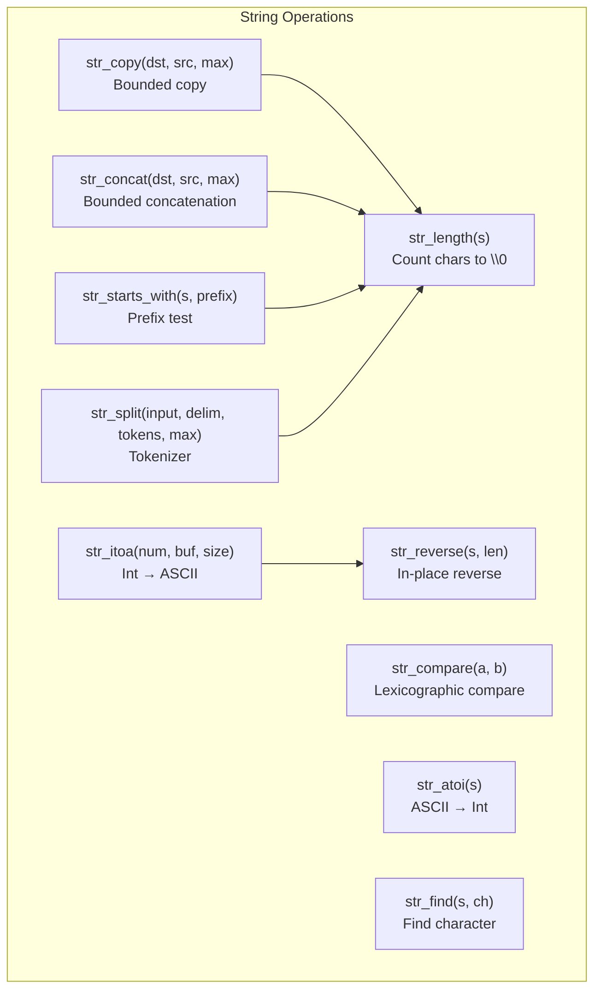
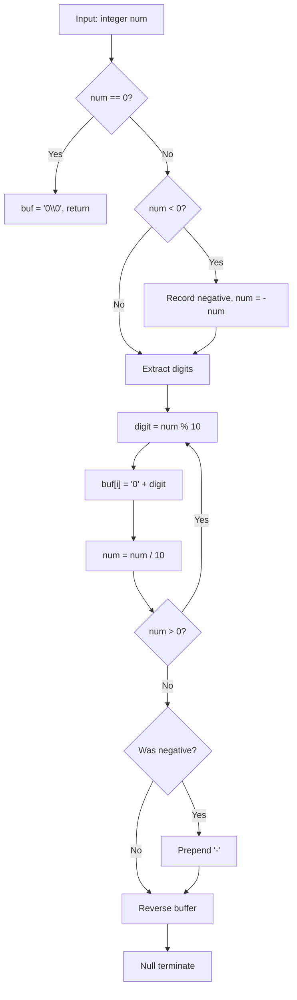
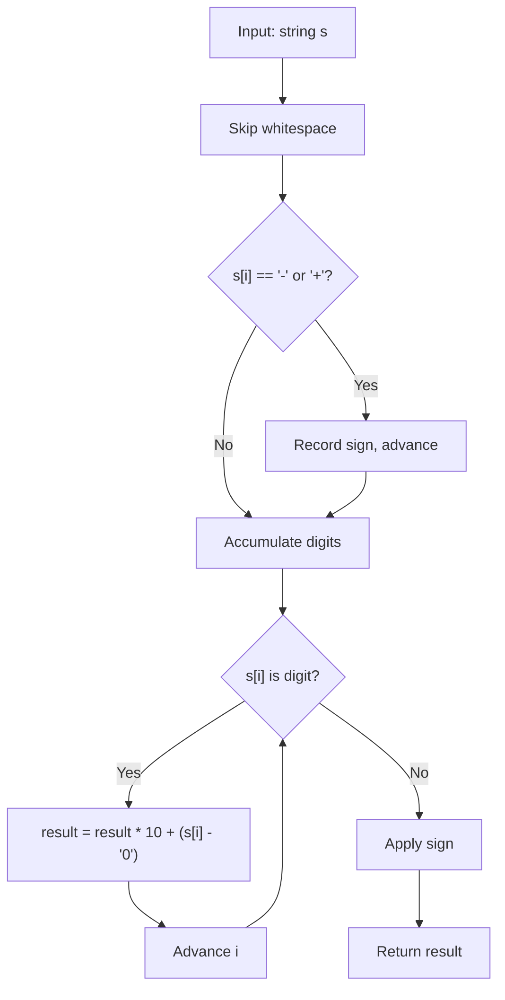
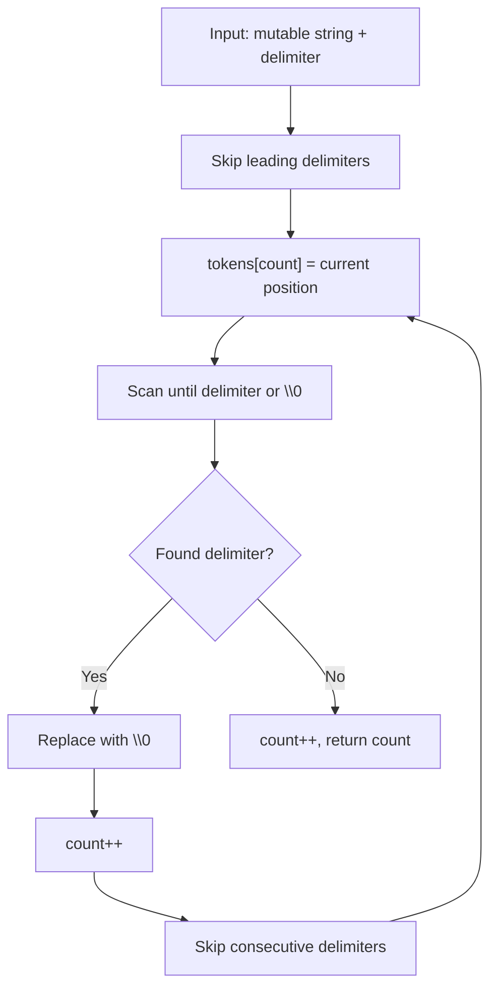

# string.c — Parser Library Design

## 1. Overview

The string library provides bounds-safe string manipulation functions built entirely with raw pointer arithmetic. It serves as the semantic interface layer — parsing user commands in the shell, formatting scores for display, and converting between numeric and text representations.

---

## 2. Core Operations

### 2.1 Function Dependency Map



---

## 3. Algorithm Details

### 3.1 str_length

```
Initialize count = 0
While s[count] != '\0':
    count++
Return count
```

**Time complexity**: O(n)

### 3.2 str_copy (Bounded)

```
Copy at most max_len - 1 characters from src to dst
Always null-terminate dst
```

This prevents buffer overflows — the most common vulnerability in C string handling.

### 3.3 str_itoa — Integer to ASCII



### 3.4 str_atoi — ASCII to Integer



### 3.5 str_split — Tokenizer

The tokenizer replaces delimiters with null terminators in-place and returns an array of pointers to the start of each token:

```
Input:  "write file.txt hello"
After:  "write\0file.txt\0hello\0"
tokens: [ptr→"write", ptr→"file.txt", ptr→"hello"]
Return: 3 (number of tokens)
```



---

## 4. Safety Model

| Risk | Mitigation |
|------|------------|
| Buffer overflow | All copy/concat functions take `max_len` parameter |
| Off-by-one | Always reserve space for null terminator |
| NULL pointer | All functions check for NULL inputs before proceeding |
| Empty string | Explicit handling for `s[0] == '\0'` cases |

---

## 5. API Reference

| Function | Signature | Description |
|----------|-----------|-------------|
| `str_length` | `int str_length(const char* s)` | String length (no `strlen`) |
| `str_copy` | `void str_copy(char* dst, const char* src, int max_len)` | Bounded string copy |
| `str_compare` | `int str_compare(const char* a, const char* b)` | Lexicographic comparison |
| `str_concat` | `void str_concat(char* dst, const char* src, int max_len)` | Bounded concatenation |
| `str_itoa` | `int str_itoa(int num, char* buf, int buf_size)` | Integer → string |
| `str_atoi` | `int str_atoi(const char* s)` | String → integer |
| `str_split` | `int str_split(char* input, char delim, char** tokens, int max)` | Tokenizer |
| `str_starts_with` | `int str_starts_with(const char* s, const char* prefix)` | Prefix match test |
| `str_find` | `char* str_find(const char* s, char ch)` | Find first occurrence |
| `str_reverse` | `void str_reverse(char* s, int len)` | In-place string reversal |
