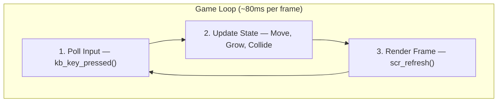
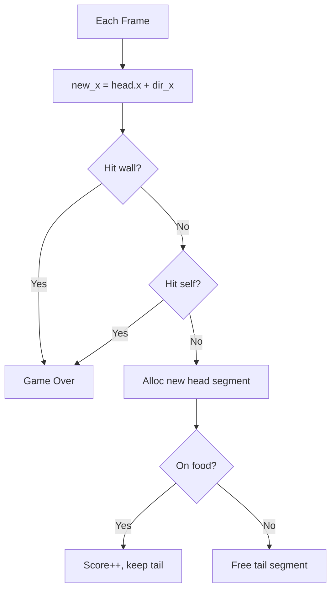

# Track A — Snake Game Design

## 1. Overview

The Snake game demonstrates seamless integration of all five custom libraries. Every entity is allocated via `memory.c`, rendered via `screen.c`, controlled via `keyboard.c`, bounded via `math.c`, and score-formatted via `string.c`.

## 2. Game Loop



## 3. Data Structures

### Snake Segment (Linked List)
```c
typedef struct SnakeSegment {
    int x, y;
    struct SnakeSegment *next;
} SnakeSegment;
```

### Game State
```c
typedef struct {
    SnakeSegment *head, *tail;
    int dir_x, dir_y;
    int food_x, food_y;
    int score, speed, game_over;
    int width, height;
} GameState;
```

## 4. Movement & Collision



## 5. Rendering Layout

| Element | Char | Color |
|---------|------|-------|
| Snake Head | `@` | Bright Green |
| Snake Body | `#` | Green |
| Food | `*` | Red |
| Wall | `#` | White |
| Score | — | Yellow |

## 6. Difficulty Scaling

```
delay = max(40000, 120000 - score * 2000) microseconds
```

## 7. Game Over → Restart or Quit
