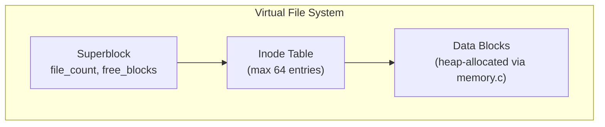
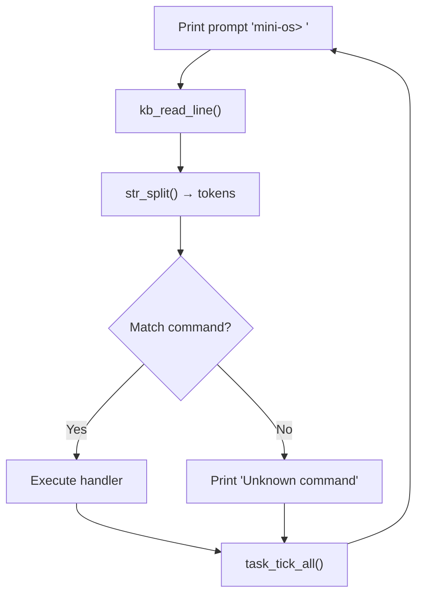

# Track B — Mini Operating System Design

## 1. Overview

The Mini OS is a simulated command-line environment with a Virtual File System (VFS), command shell, and cooperative task scheduler — all running within Virtual RAM.

## 2. VFS Architecture



### Inode Structure
```c
typedef struct {
    char name[32];
    int  size;
    int  is_dir;
    int  is_used;
    char *data;          // Pointer into heap
    int  parent_inode;   // Parent directory index
} Inode;
```

## 3. Shell Commands

| Command | Syntax | Description |
|---------|--------|-------------|
| `help` | `help` | List all commands |
| `echo` | `echo <text>` | Print text |
| `ls` | `ls` | List files in current dir |
| `touch` | `touch <name>` | Create empty file |
| `write` | `write <name> <content>` | Write to file |
| `read` / `cat` | `read <name>` | Display file contents |
| `rm` | `rm <name>` | Delete file |
| `memmap` | `memmap` | Visualize heap |
| `clear` | `clear` | Clear screen |
| `exit` | `exit` | Quit Mini OS |

## 4. Shell Loop



## 5. Cooperative Task Scheduler

```c
typedef struct {
    void (*tick)(void *state);
    void *state;
    int   active;
    char  name[16];
} Task;
```

Tasks are ticked once per shell iteration — cooperative multitasking without preemption.

### Built-in Tasks
- **Clock**: Updates time display in corner
- **Counter**: Increments and displays a counter

## 6. Memory Map Visualization

The `memmap` command prints a visual representation of heap blocks:
```
[USED  128B] [FREE  256B] [USED   64B] [FREE 1024B]
████████████ ░░░░░░░░░░░░ ████████████ ░░░░░░░░░░░░
Total: 65536B | Used: 192B | Free: 1280B | Blocks: 4
```
